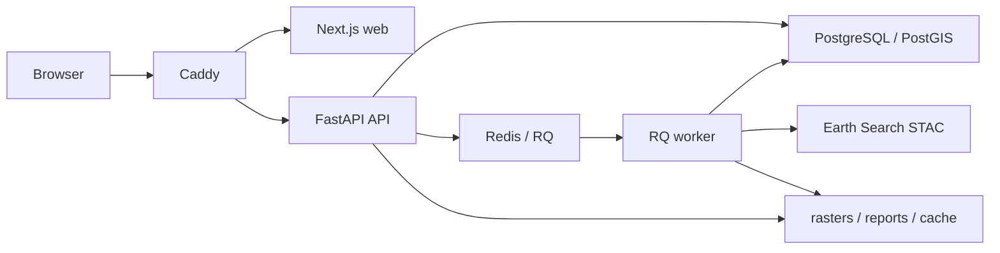

# GeoEco Monitor: production deploy на VPS

Документ описывает production-контур Docker для VPS. Локальная разработка остается через `npm run dev` без Docker.

## Состав контура

- `proxy`: Caddy reverse proxy, маршрутизирует публичный интерфейс и API.
- `web`: Next.js production frontend на порту `3000` внутри сети Docker.
- `api`: FastAPI backend на порту `8000` внутри сети Docker.
- `postgres`: PostgreSQL/PostGIS для production-хранилища.
- `redis`: инфраструктурный Redis для будущей очереди/кэша.
- `worker`: RQ worker для live analysis, comparison jobs и PDF generation.

Persistent volumes:

- `geoeco_rasters`: raster outputs;
- `geoeco_reports`: PDF/HTML/assets отчетов;
- `geoeco_cache`: tile cache и временный cache;
- `geoeco_db`: PostgreSQL/PostGIS data;
- `geoeco_redis`: Redis data;
- `caddy_data`, `caddy_config`: сертификаты и конфигурация Caddy.

## Архитектура production-запуска



## Подготовка VPS

1. Установить Docker Engine и Docker Compose plugin.
2. Склонировать репозиторий:

```bash
git clone <repo-url> /opt/geoeco-monitor
cd /opt/geoeco-monitor
```

3. Создать production env:

```bash
cp .env.production.example .env.production
```

4. Отредактировать `.env.production`:

```text
PUBLIC_DOMAIN=geoeco.example.com
POSTGRES_PASSWORD=<strong-password>
DATABASE_URL=postgresql+psycopg://geoeco:<strong-password>@postgres:5432/geoeco
CORS_ALLOWED_ORIGINS=
```

Для теста без домена можно оставить:

```text
PUBLIC_DOMAIN=:80
```

`CORS_ALLOWED_ORIGINS` можно оставить пустым при обычном Caddy same-origin deployment. Если API нужно открыть для отдельного frontend origin, задайте точный origin через запятую, без `*`.

## Сборка и запуск

```bash
docker compose --env-file .env.production -f docker-compose.prod.yml build
docker compose --env-file .env.production -f docker-compose.prod.yml up -d
```

Проверка:

```bash
docker compose --env-file .env.production -f docker-compose.prod.yml ps
curl http://localhost/health
docker compose --env-file .env.production -f docker-compose.prod.yml logs -f worker
```

Если `PUBLIC_DOMAIN` указывает на домен и DNS уже ведет на VPS, Caddy автоматически выпустит TLS-сертификат.

## Локальный smoke-тест production compose

Чтобы не занимать локальные `80/443`, можно переопределить порты:

```powershell
$env:HTTP_PORT="8080"
$env:HTTPS_PORT="8443"
$env:PUBLIC_DOMAIN=":80"
docker compose -f docker-compose.prod.yml up -d --build
curl http://localhost:8080/health
```

Остановка:

```powershell
docker compose -f docker-compose.prod.yml down
```

## Очередь задач

В production API работает в режиме:

```text
JOB_EXECUTION_MODE=rq
```

API создает запись job в DB, кладет задачу в Redis и быстро возвращает id. Worker забирает задачи командой:

```text
python -m app.worker
```

Проверка очереди:

```bash
docker compose --env-file .env.production -f docker-compose.prod.yml exec worker rq info -u "$REDIS_URL"
```

Масштабирование:

```bash
docker compose --env-file .env.production -f docker-compose.prod.yml up -d --scale worker=2
```

Если Redis недоступен, API вернет понятную ошибку. Если очередь переполнена (`QUEUE_MAX_JOBS`), API вернет ошибку перегрузки и не начнет тяжелый расчет внутри request thread.

## Ограничения текущей версии

- Comparison parent job выполняет child analysis jobs внутри worker последовательно. Отдельное fan-out/fan-in расписание child jobs можно добавить позже, если понадобится параллельное сравнение.
- Production DB подключен через `DATABASE_URL`, но текущая Phase 5 не добавляет миграции и не меняет модель хранения.
- Результаты остаются предварительной дистанционной оценкой и не заменяют лабораторные измерения, экспертизу и натурное обследование.
