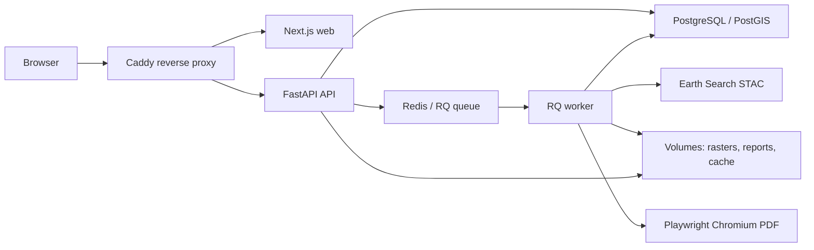

# GeoEco Monitor

GeoEco Monitor — публичный аналитический дашборд предварительной дистанционной оценки территории по спутниковым данным Sentinel-2 L2A.

Проект создается как MVP для портфолио и защиты дипломной работы “Оценка качества окружающей среды современными методами дистанционного зондирования”.

## Что умеет проект

- Выполняет live Sentinel-2 L2A анализ через Earth Search STAC.
- Считает NDVI, NDWI, NDBI и интегральную предварительную оценку.
- Показывает карту анализа с RGB/NDVI/NDWI/NDBI raster layers.
- Считает coverage metrics: покрытие зоны, валидные пиксели, облака/тени и nodata.
- Поддерживает comparison mode 2020 ↔ 2025 с parent job и двумя дочерними расчетами.
- Формирует реальные PDF-отчеты для single analysis и comparison.
- Имеет production-контур: Docker, Caddy, PostGIS, Redis/RQ worker и persistent volumes.

## Быстрая демонстрация

Пошаговый сценарий защиты: `docs/DEMO_WALKTHROUGH.md`.

Скриншоты:

- `docs/screenshots/dashboard-demo.png`
- `docs/screenshots/comparison-result.png`
- `docs/screenshots/pdf-report-preview.png`
- `docs/screenshots/comparison-pdf-preview.png`

## Архитектура



## Что есть в Phase 1

- Monorepo: Next.js frontend и FastAPI backend.
- Локальный запуск без Docker: `npm run dev`.
- Backend endpoints:
  - `GET /health`
  - `GET /api/zones/defaults`
  - `POST /api/analyses`
  - `GET /api/analyses/{analysisId}`
  - `GET /api/analyses/{analysisId}/result`
  - `POST /api/comparisons`
  - `GET /api/comparisons/{comparisonId}`
  - `GET /api/comparisons/{comparisonId}/result`
- Три стандартные bbox-зоны методики в `default-zones.geojson`.
- Reference fixtures диплома в `thesis-reference-results.json`.
- Live pipeline: STAC search, выбор Sentinel-2 сцены, поиск assets, rasterio-чтение окон, SCL mask, NDVI/NDWI/NDBI, статистика, scoring.
- Dashboard shell: выбор зоны/года, запуск расчета или сравнения 2020 ↔ 2025, статус, карта bbox, метаданные сцены, индексы, класс, интерпретация и ограничения метода.

## Требования

- Node.js 20.19.x LTS
- Python 3.11 x64
- Windows PowerShell или совместимая оболочка

Docker для локальной разработки не требуется. Production Docker-контур используется только для VPS.

## Локальный запуск

```powershell
nvm use 20.19.0
npm install
npm run dev
```

Frontend: <http://localhost:3000>  
Backend: <http://localhost:8000>

`npm run dev` создает `apps/api/.venv`, устанавливает backend-зависимости и запускает оба сервера.

## Если не установился rasterio/GDAL на Windows

Live raster pipeline зависит от `rasterio`. Если установка падает:

1. Проверьте, что установлен Python 3.11 x64.
2. Обновите pip:

```powershell
apps\api\.venv\Scripts\python.exe -m pip install --upgrade pip
```

3. Повторите установку:

```powershell
apps\api\.venv\Scripts\pip.exe install -r apps\api\requirements.txt
```

Если wheel для вашей среды недоступен, используйте production Docker на VPS после Phase 2/3. Phase 1 честно остановится с понятной ошибкой, потому что без rasterio/GDAL live Sentinel-2 расчет невозможен.

## Проверки

```powershell
npm run lint
npm run build
pytest
ruff check
```

## Как проверить live analysis локально

1. Запустите dev-серверы:

```powershell
npm run dev
```

2. В отдельном PowerShell проверьте backend:

```powershell
Invoke-RestMethod http://localhost:8000/health
```

3. Запустите минимальный live-расчет для Ростова-на-Дону за 2020 год:

```powershell
@'
import json, time, requests

payload = {
    "zoneSlug": "rostov_on_don",
    "zoneName": "Ростов-на-Дону",
    "geometry": {
        "type": "Polygon",
        "coordinates": [[[39.58, 47.11], [39.82, 47.11], [39.82, 47.36], [39.58, 47.36], [39.58, 47.11]]]
    },
    "year": 2020,
    "dateRange": {"start": "2020-07-01", "end": "2020-08-15"},
    "mode": "single",
    "cloudCoverMax": 20,
    "isCustomZone": False
}

created = requests.post("http://localhost:8000/api/analyses", json=payload, timeout=30)
created.raise_for_status()
analysis_id = created.json()["analysisId"]

while True:
    job = requests.get(f"http://localhost:8000/api/analyses/{analysis_id}", timeout=20).json()
    print(job["status"], job["progress"], job["stage"])
    if job["status"] in {"succeeded", "failed"}:
        print(json.dumps(job, ensure_ascii=False, indent=2))
        break
    time.sleep(3)

if job["status"] == "succeeded":
    result = requests.get(f"http://localhost:8000/api/analyses/{analysis_id}/result", timeout=20)
    print(json.dumps(result.json(), ensure_ascii=False, indent=2))
'@ | apps\api\.venv\Scripts\python.exe -
```

4. Успешный расчет должен пройти этапы поиска STAC-кандидатов, выбора сцены, чтения каналов, SCL mask, расчета NDVI/NDWI/NDBI и вернуть `stats`.

## Как проверить raster layers локально

Raster layers появляются только после успешного live analysis. Они не строятся из thesis fixtures.

Для стандартных зон диплома backend использует thesis reference scene как ориентир выбора:

- exact id, если STAC item совпал буквально;
- same date + same MGRS tile;
- same tile near reference date;
- alternative по покрытию/облачности.

Выбор сцены ранжирует candidates по estimated coverage, близости к reference date/tile/platform и cloud cover. Это не подменяет live result fixtures: fixtures используются только как reference metadata для выбора и сравнения.

После завершения расчета backend сохраняет GeoTIFF outputs в:

```text
data/rasters/{analysisId}/rgb.tif
data/rasters/{analysisId}/ndvi.tif
data/rasters/{analysisId}/ndwi.tif
data/rasters/{analysisId}/ndbi.tif
```

`GET /api/analyses/{analysisId}/result` возвращает `coverage` с метриками качества данных:

- `zoneAreaSqKm`;
- `rasterCoverageRatio`;
- `validPixelRatio`;
- `maskedPixelRatio`;
- `cloudMaskedPixelRatio`;
- `nodataPixelRatio`;
- `selectedSceneIntersectsZone`;
- `coverageWarning`;
- `methodNote`.

Метрики coverage считаются по пикселям внутри методической геометрии зоны. `cloudMaskedPixelRatio` использует SCL classes `3, 8, 9, 10, 11`; `nodataPixelRatio` использует отсутствие значений каналов и SCL classes `0/1`. Это прикладная оценка качества входных данных для интерпретации, а не отдельная экологическая классификация.

`rasterLayers` содержит:

- `layer`;
- `path`;
- `min`;
- `max`;
- `nodata`;
- `crs`;
- `bounds`;
- `tileUrl`.

Tile endpoint:

```text
GET /api/tiles/{analysisId}/{layer}/{z}/{x}/{y}.png
```

Поддерживаемые значения `layer`:

- `rgb`;
- `ndvi`;
- `ndwi`;
- `ndbi`.

Индексные тайлы цветизуются на backend со стабильными диапазонами:

- NDVI: `-0.2` to `0.8`;
- NDWI: `-0.5` to `0.6`;
- NDBI: `-0.6` to `0.6`.

На dashboard после успешного расчета можно переключать RGB / NDVI / NDWI / NDBI и менять прозрачность слоя.

## Comparison mode 2020 ↔ 2025

Phase 3 добавляет parent comparison analysis:

```text
POST /api/comparisons
GET /api/comparisons/{comparisonId}
GET /api/comparisons/{comparisonId}/result
```

`POST /api/comparisons` создает parent `ComparisonJob` и два child `AnalysisJob`:

- child 2020;
- child 2025.

Каждый child job выполняет обычный live Sentinel-2 расчет и имеет собственные:

- статус;
- progress/logs/error;
- `SceneMetadata`;
- `CoverageMetrics`;
- `RasterAsset`;
- `AnalysisResult`.

Parent агрегирует результаты в таблицу изменений:

- NDVI;
- NDWI;
- NDBI;
- rawScore;
- normalizedScore;
- validPixelRatio;
- rasterCoverageRatio;
- classLabel.

Для числовых показателей возвращаются `delta`, безопасный `percentChange` и `trend`. Если один child job успешен, а второй завершился ошибкой, parent status становится `partial`, а UI показывает доступный результат и честную ошибку второго года.

Для ручной проверки готовый comparison result можно открыть через query string:

```text
http://localhost:3000/?comparisonId=<comparisonId>&comparisonYear=2025
```

Reference comparison из `thesis-reference-results.json` показывается отдельно и не подменяет live result.

## Tile cache

Rendered PNG tiles кэшируются локально, если `TILE_CACHE_ENABLED=true`:

```text
data/cache/tiles/{analysisId}/{layer}/{z}/{x}/{y}.png
```

Поведение:

- cache hit: PNG отдается сразу с диска;
- cache miss: backend рендерит tile, сохраняет PNG в cache и возвращает ответ;
- cache учитывает `analysisId`, `layer`, `z`, `x`, `y`.

Очистка cache вручную:

```powershell
Remove-Item -Recurse -Force data\cache\tiles
```

После следующего запроса тайлы будут построены заново.

## Raster output format

Сейчас outputs пишутся как tiled/compressed GeoTIFF:

- internal block size `256 x 256`;
- compression `LZW`;
- `BIGTIFF=IF_SAFER`;
- nodata прописан для индексных слоев;
- RGB preview пишется как 4-band RGBA.

Это не полноценный COG output. Архитектура writer подготовлена так, чтобы позже заменить или расширить запись через `rio-cogeo`, но зависимость не включена по умолчанию, чтобы не усложнять Windows local dev.

## Non-blocking dev warnings

На Windows Next.js может писать warning:

```text
Attempted to load @next/swc-win32-x64-msvc
```

Для Windows local dev рекомендуется Node `20.19.0`; версия зафиксирована в `.nvmrc` и `package.json#engines`.

Если `npm run build` завершается успешно, это считается non-blocking warning среды: Next использует fallback-компиляцию. После запуска `npm run build` при активном `npm run dev` перезапустите dev-сервер, потому что обе команды используют `apps/web/.next`.

В текущей Windows-среде native `@next/swc-win32-x64-msvc` может не загрузиться с `ERR_DLOPEN_FAILED`, после чего Next использует wasm fallback. Проверенное состояние Phase 3.1: `npm run build` завершается с exit code `0`, но warning native SWC остается как non-blocking warning окружения. Если build падает с `3221225477`, выполните:

```powershell
nvm install 20.19.0
nvm use 20.19.0
Remove-Item -Recurse -Force node_modules
npm cache verify
npm install
npm run build
```

Подробнее: `docs/phase-3-1-build-stability-demo-polish.md`.

## PDF-отчеты

Phase 4 добавляет реальные PDF-отчеты для single analysis и comparison result.

Endpoints:

```text
POST /api/reports/analysis/{analysisId}
GET /api/reports/analysis/{analysisId}.pdf
POST /api/reports/comparison/{comparisonId}
GET /api/reports/comparison/{comparisonId}.pdf
```

PDF сохраняются локально:

```text
data/reports/analysis/{analysisId}.pdf
data/reports/comparison/{comparisonId}.pdf
```

HTML для отладки:

```text
data/reports/html/analysis/{analysisId}.html
data/reports/html/comparison/{comparisonId}.html
```

Preview PNG для PDF строятся backend-side из GeoTIFF outputs и сохраняются в:

```text
data/reports/assets/...
```

Для реальной печати PDF нужен Chromium для Playwright:

```powershell
apps\api\.venv\Scripts\python.exe -m pip install -r apps\api\requirements.txt
apps\api\.venv\Scripts\python.exe -m playwright install chromium
```

Если Chromium не установлен, API вернет понятную ошибку с этой командой. PDF строится из backend data и raster outputs, а не из screenshot dashboard UI.

Подробнее: `docs/phase-4-pdf-report.md`.

## Production Docker / VPS

Phase 5 добавляет production-контур для VPS:

- Caddy reverse proxy;
- Next.js web;
- FastAPI API;
- PostgreSQL/PostGIS;
- Redis;
- persistent volumes для rasters, reports, cache и db.

Локальная разработка остается без Docker:

```powershell
npm run dev
```

Production smoke/build:

```powershell
Copy-Item .env.production.example .env.production
$env:HTTP_PORT="8080"
$env:HTTPS_PORT="8443"
$env:PUBLIC_DOMAIN=":80"
docker compose --env-file .env.production -f docker-compose.prod.yml build
docker compose --env-file .env.production -f docker-compose.prod.yml up -d
curl http://localhost:8080/health
```

На VPS используйте реальные `PUBLIC_DOMAIN`, `POSTGRES_PASSWORD` и `DATABASE_URL`. Подробная инструкция: `DEPLOY_VPS.md`.

Ограничение Phase 5: отдельный `worker` включен как reserved Docker profile, но расчеты пока выполняются API через in-process executor. Полноценная queue-based обработка будет отдельным этапом.

## Redis/RQ worker queue

Phase 6 выносит тяжелые production-задачи в Redis/RQ:

- single live analysis;
- comparison parent job с дочерними analysis jobs;
- PDF generation для single analysis;
- PDF generation для comparison.

Локально по умолчанию используется простой режим:

```text
JOB_EXECUTION_MODE=in_process
```

Поэтому обычный запуск на Windows не требует Redis и Docker:

```powershell
npm run dev
```

Production использует:

```text
JOB_EXECUTION_MODE=rq
REDIS_URL=redis://redis:6379/0
QUEUE_NAME=geoeco
QUEUE_MAX_JOBS=20
RQ_ANALYSIS_TIMEOUT=3600
RQ_COMPARISON_TIMEOUT=7200
RQ_REPORT_TIMEOUT=1200
```

В `rq` режиме API быстро создает DB record, ставит задачу в Redis и возвращает id. Расчет выполняет `worker`:

```text
python -m app.worker
```

Диагностика на VPS:

```bash
docker compose --env-file .env.production -f docker-compose.prod.yml logs -f worker
docker compose --env-file .env.production -f docker-compose.prod.yml exec worker rq info -u "$REDIS_URL"
```

Масштабирование worker-ов:

```bash
docker compose --env-file .env.production -f docker-compose.prod.yml up -d --scale worker=2
```

Подробнее: `docs/phase-6-worker-queue.md`.

## Методическое ограничение

Результаты являются предварительной дистанционной оценкой по спутниковым данным Sentinel-2 и не заменяют лабораторные измерения, санитарно-гигиеническую экспертизу и натурное обследование.

Приложение не формирует санитарное заключение, не доказывает загрязнение и не присваивает официальный нормативный класс.
